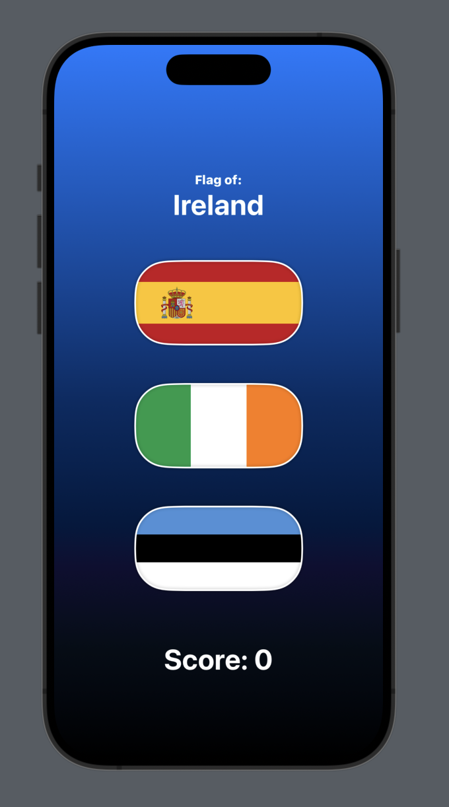
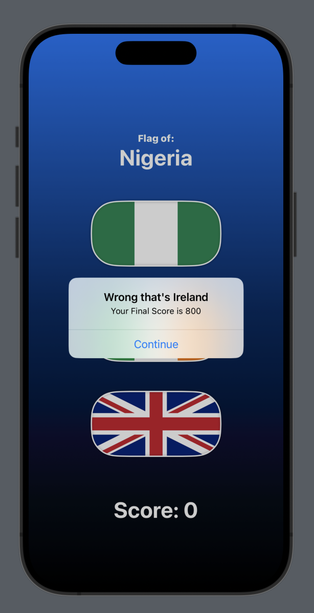

#  Description

A game to guess flags made in SwiftUI

## How it works
The player taps on the correct flag and will increase their score by 100
If the player taps on the wrong flag, the game will end by presenting the final score

Game and score resets

## Screenshots
### Home:

### Gameover:

